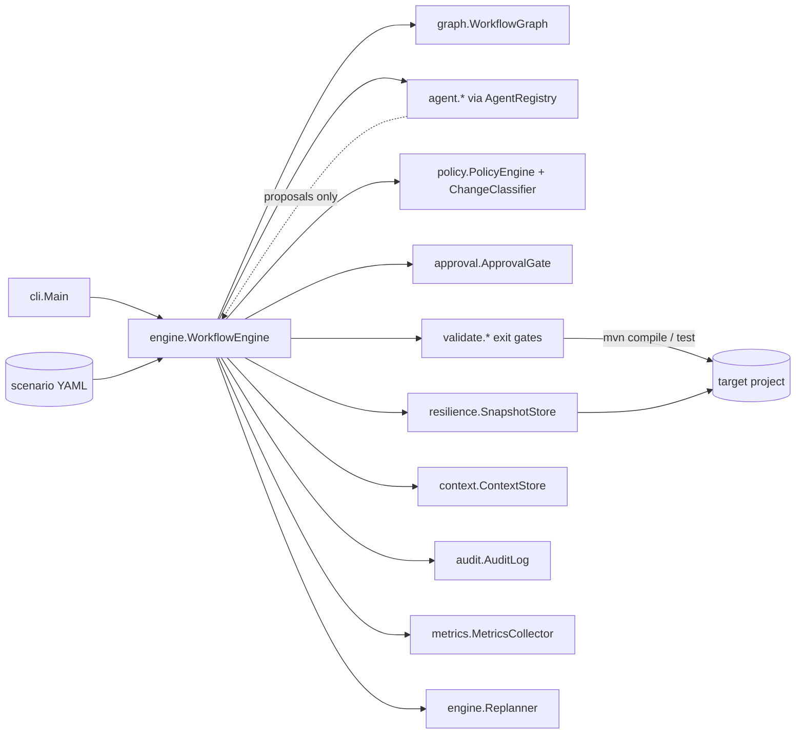
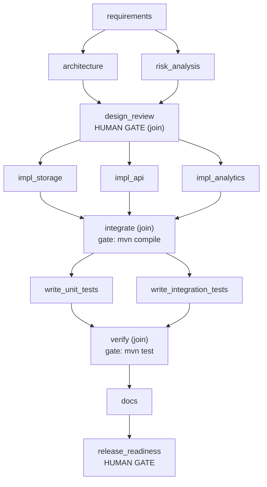
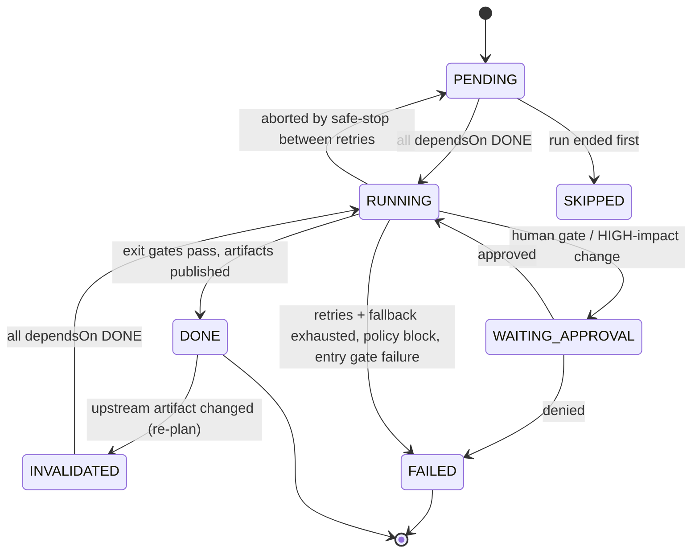
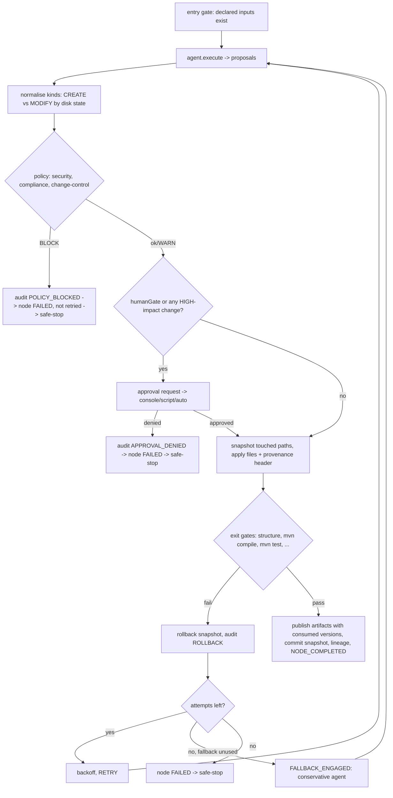

# Architecture

## 1. The idea in one paragraph

An **agent proposes, the engine disposes.** Agents are pure functions from context to *proposals* (artifacts and file
changes). They never touch the target project. The engine takes every proposal through the same governed pipeline –
policy check, human approval when required, snapshot, apply, exit-gate validation, publish – and owns every
state transition. Because governance sits in the engine rather than in the agents, autonomy can be widened or
narrowed (or the agents swapped for LLM-backed ones) without changing the controls.

## 2. Components

| Package | Responsibility |
|---|---|
| `graph` | Node/edge model from YAML, cycle detection, topological layers, join detection, descendants, **data-flow dirty closure** |
| `engine` | Ready-set scheduler on a thread pool, node execution pipeline, events, re-planning, persistence, reporting |
| `agent` | `Agent` contract and the shipped agents: requirements, architect, risk, reviewer, impact-analyst, implementer/tester (template), documenter, release-manager |
| `policy` | Security, compliance and change-control rules; engine-side impact classification (LOW/HIGH) |
| `approval` | Human checkpoints: console (fail-closed), scripted (CI/demo), auto (explicitly labelled) |
| `resilience` | File snapshots + rollback, safe-stop/kill switch, deterministic fault injection |
| `validate` | Exit gates: structure, `mvn compile`, `mvn test`, design-docs, docs-present |
| `context` | Versioned, content-hashed artifacts shared between stages |
| `audit` | Append-only, hash-chained JSONL and its verifier |
| `metrics` | Success rate, retries, rollbacks, fallbacks, MTTR, latency |

## 3. Workflow model

A scenario is a DAG of nodes. Each node declares:

| Field | Meaning |
|---|---|
| `dependsOn` | **Control** dependencies (ordering, synchronisation – a node with >1 dependency is a *join*) |
| `consumes` / `produces` | **Data** dependencies on versioned artifacts (drives entry gate, lineage and re-planning) |
| `agent` / `fallbackAgent` | Who does the work; the fallback is a more conservative implementation used after retries are exhausted |
| `exitGate` | Validators that must pass after the change is applied |
| `humanGate` / `gateReason` | Unconditional human approval checkpoint |
| `maxRetries`, `params` | Per-node overrides |

Greenfield graph (`join` nodes are where parallel branches synchronise):

### Node states

## 4. Node execution pipeline (the governed path)

Key properties:

* **Policy runs before anything is written**, so a blocked change leaves no trace on disk.
* **Impact is classified by the engine** (`ChangeClassifier`), never self-declared by an agent: deletes, `pom.xml`
  modifications, `.sql` modifications and modifications of production `api/` or `dto/` code are HIGH and require
  approval even on nodes without a `humanGate`. New files and test changes are LOW.
* **Approvals are bound to the proposal.** An approval is remembered for an identical proposal (same node, same
  consumed artifact versions, same file hashes) so a retry after a validator failure is not re-prompted, but any
  change to inputs or content asks again. Anything other than an explicit yes is a denial.
* **Retries are bounded** three ways: per node (`maxRetries`, default 2 → 3 attempts), per run (`maxAttemptsTotal`,
  default 200, enforced inside the retry loop) and by wall-clock (`maxRuntimeMs`, default 45 min). Backoff is exponential.
* **Fallback** gets exactly one attempt and renders the vetted baseline without requirement-derived parameters.
* **Rollback is file-exact.** Pending snapshots restore overwritten files and delete created ones. Committed snapshots
  are persisted per node so a re-plan can undo *completed* work in reverse completion order.
* **Safe-stop**: the first unrecoverable failure trips a latch; no new nodes are scheduled, in-flight nodes finish
  their current attempt but do not retry, unreached nodes become `SKIPPED`, state is persisted, and the run is
  `HALTED` (exit code 2). `resume` resets non-`DONE` nodes to `PENDING` and continues.
* **Kill switch**: a `STOP` file in the run directory has the same effect as a failure-triggered safe-stop.

## 5. Non-linear execution and synchronisation

The scheduler is a loop over a *ready set*, not a list: every iteration it submits all nodes whose `dependsOn`
are `DONE` to a thread pool and then blocks on the next completion. Independent branches therefore overlap
(proved by `WorkflowEngineTest.independentNodesRunInParallelAndJoinWaitsForAll`, which fails unless two nodes run
simultaneously), and a join node starts only when every upstream branch finished. Parallel nodes are expected to touch
disjoint files; the shipped scenarios guarantee that by construction (see limitations).

## 6. Context, lineage and dynamic re-planning

Artifacts are immutable, versioned and SHA-256 hashed. Writing identical content does **not** create a new version,
which is what makes re-planning precise. Every node completion records `consumed{artifact→version}` and
`produced{artifact→version}`; `report.md` and `lineage.json` render that as the decision lineage.

An external event (here: a stakeholder clarification, scripted in the scenario) can change upstream artifacts:

1. Apply the answer → new versions of only the affected requirement slices (`req.security`, `req.ambiguities`).
2. `dirtyClosure(changed)` – nodes that **consume** a changed artifact, plus nodes that consume anything those nodes
   **produce**, transitively. This is deliberately *data-flow*, not graph descent: `impl_cache` depends (control-wise)
   on the re-approved `design_review`, but consumes only `req.performance`, so it keeps its result.
3. Drain in-flight nodes (events are applied only when nothing is running), then roll back the dirty, completed
   nodes' file changes newest-first and mark them `INVALIDATED`.
4. The scheduler naturally re-runs exactly those nodes; changed requirements force a fresh `design_review` approval.

Real result (ambiguous scenario): invalidated `architecture, risk_analysis, design_review, impl_validator,
update_tests`; retained `requirements, impl_cache`; `UrlValidator` regenerated as HTTPS-only.

## 7. Audit and observability

`audit.jsonl` is append-only; each record is `{seq, ts, traceId, type, actor, node, data, prevHash, hash}` with
`hash = SHA-256(record without hash)` and `prevHash` = previous record's hash. `verify-audit` recomputes the chain
and detects edited, deleted, inserted and reordered records (unit-tested for each). Actors are explicit:
`orchestrator`, `agent:<name>`, `policy-engine`, `validator:<name>`, `human:<approver>`.

Event types: `RUN_STARTED/RESUMED/FINISHED`, `NODE_STARTED/COMPLETED/FAILED/ABORTED/SKIPPED`, `ATTEMPT_STARTED/
SUCCEEDED/FAILED`, `POLICY_EVALUATED/BLOCKED`, `APPROVAL_REQUESTED/GRANTED/DENIED`, `CHANGES_APPLIED`, `VALIDATION`,
`ROLLBACK`, `RETRY`, `FALLBACK_ENGAGED`, `EVENT_APPLIED`, `REPLAN`, `SAFE_STOP`.

Metrics (`metrics.json`):

| Metric | Definition |
|---|---|
| `node_success_rate` | nodes `DONE` at the end ÷ nodes in the graph |
| `first_attempt_success_rate` | node executions that succeeded on attempt 1 ÷ completed executions (re-runs count) |
| `retries`, `fallbacks`, `rollbacks`, `policy_blocks`, `replans` | counters (a re-plan's rolled-back nodes count as rollbacks) |
| `mttr_ms` | mean time from a node's **first failed attempt** to that node reaching `DONE`; `null` if no incident recovered |
| `unrecovered_incidents` | nodes that failed and never recovered |
| `e2e_latency_ms`, `node_latency_ms` | wall clock for the run / per node (including retries) |
| `approvals_requested/denied`, `approval_wait_ms` | human-in-the-loop cost |

## 8. Autonomy boundaries

| Agents may | Agents may not |
|---|---|
| Read the target project and all published artifacts | Write to the target (the engine writes) |
| Propose new/modified/deleted files and artifacts | Declare their own proposals low-risk |
| Be retried, replaced by a fallback, rolled back | Skip policy, approval, validation or audit |
| Act without a human for LOW-impact changes inside the allow-list | Touch `.git/`, `.github/`, paths outside the target, unlisted file types, unapproved dependency groups, more than 40 files/node, files > 200 kB |

Humans approve: every `humanGate` node, every HIGH-impact change, and the release decision. The release agent only
*recommends* GO / CONDITIONAL / NO-GO from run facts (tests actually executed, open ambiguities, policy blocks, audit
integrity, nodes not done); the human decides.

## 9. Policy guardrails

| Rule | Blocks (production code) | Notes |
|---|---|---|
| Security | hard-coded secrets, `Runtime.exec`/`ProcessBuilder`, `ObjectInputStream`, SQL built by string concatenation | In `src/test/` the same findings are WARN |
| Compliance | PII-looking identifiers in log statements, copyleft licence text | |
| Change control | path escape/absolute paths, protected paths, disallowed file types, size/count limits, dependency groups outside an allow-list | Supply-chain control on `pom.xml` |

Generated Java files also receive a provenance header (`// Generated by agentic orchestrator | run … | node …`).

## 10. Key decisions and alternatives

| Decision | Why | Alternative rejected |
|---|---|---|
| Agents propose; engine applies | One enforcement point; agents stay swappable and untrusted | Letting agents write directly and checking afterwards (no clean rollback, no pre-write policy) |
| Data-flow dirty closure for re-planning | Re-run only what the change can affect; retained work keeps its approval | Re-running all descendants (wasteful, repeats approvals) or all nodes |
| Deterministic template agents | Reproducible, offline, testable, reviewable; governance can be proven independent of model behaviour | Calling an LLM in the prototype (non-deterministic tests, secrets, cost) – seam is preserved |
| Vetted templates *plus* real `mvn compile/test` gates | A bad template is caught by the exit gate (it was – see summary) | Trusting templates |
| File snapshots in the run directory | Works on any target, no VCS required, supports undoing completed nodes | `git stash/reset` (requires a clean repo, hard with parallel nodes) |
| Hash-chained JSONL | Zero infrastructure, tamper-evident, greppable | Database (heavier), plain log (no integrity) |
| In-process thread pool | Sufficient to prove parallel/join semantics | Distributed workers/queue (see scale path below) |
| Approval fails closed | Safe default for EOF/typos/unattended runs | Default-approve |
| Rate limiter, cache, repository behind small interfaces in the target | Swap H2/Redis/Postgres without touching the API | Hard-wired infrastructure |

## 11. Scale path (not built)

Externalise run state (Postgres), move nodes to a work queue with per-node leases, replace `SnapshotStore` with VCS
commits/branches, anchor the audit chain head in an external WORM/ledger store, make approvals a ticketing/chat-ops
integration with identity, and add per-file locks (or a conflict check on proposed paths) for parallel nodes.

## 12. Extending

* **New agent**: implement `Agent`, register in `AgentRegistry.defaults()`, reference by name in a scenario.
* **New validator**: implement `Validator`, register in `ValidatorRegistry.defaults()`, list under `exitGate`.
* **New policy rule**: implement `PolicyRule`, add to `PolicyEngine.defaults()`.
* **New scenario**: a YAML file passed to `--scenario`; `graph --scenario` prints the Mermaid diagram, and the graph is
  validated (unknown/duplicate nodes, cycles) at load time.
* **LLM-backed agent**: same `Agent` interface; keep proposals as `FileChange`/`ArtifactWrite`; nothing else changes.
