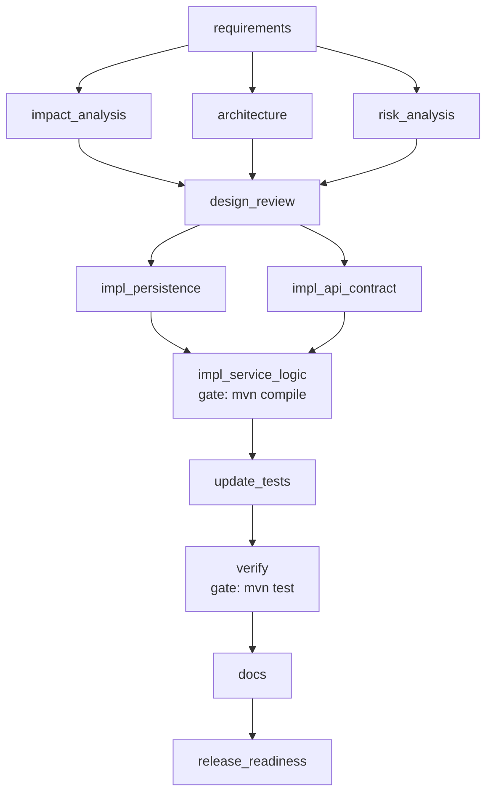
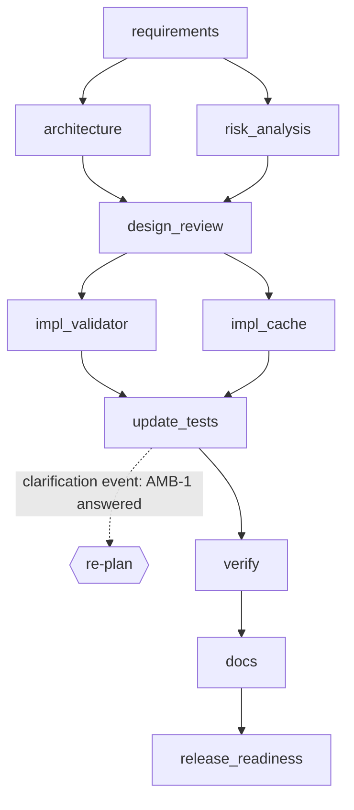

# Scenarios

Three scenarios, chained the way a real system evolves: **greenfield → brownfield (on its output) → ambiguous (on
that)**. All numbers below come from `scripts/run-all.sh` and `scripts/chaos-demo.sh`, with real `mvn compile` /
`mvn test` executed at the exit gates. The evidence (report, metrics, hash-chained audit log, lineage) for every run
is committed under [`docs/runs/`](runs/).

| Scenario | Nodes | Parallel layers / joins | Human approvals | Test count of resulting service | e2e |
|---|---|---|---|---|---|
| Greenfield | 13 | 3 fan-outs, 3 joins | 2 | 71 | 22.7 s |
| Brownfield | 12 | 2 fan-outs, 2 joins | 4 | 87 | 21.5 s |
| Ambiguous | 10 | 2 fan-outs, 2 joins; 1 re-plan | 3 | 98 | 17.3 s |

---

## 1. Greenfield – "Build a URL shortener"

**Requirement (raw):** create short URLs with optional custom aliases, redirect, administrator delete, per-link click
analytics, rate limiting on write APIs, destination URL safety validation (SSRF).

### Understanding and normalisation
The requirements agent turns the text into four artifacts so later stages depend only on the slice they need:
`req.functional` (FR-1…FR-7 with acceptance criteria), `req.security`, `req.performance`, `req.ambiguities`
(none here: "safety" is pinned down by "(SSRF)", so it is *not* flagged vague).

### Decomposition and dependencies

| Stage | Nodes | Depends on | Exit gate |
|---|---|---|---|
| Requirements | `requirements` | – | – |
| Design (parallel) | `architecture`, `risk_analysis` | requirements | `structure` + `design-docs` (OpenAPI parses, has paths); `structure` |
| **Design review** | `design_review` (human gate, join) | both | approval of the exact artifact versions |
| Implementation (parallel) | `impl_storage`, `impl_api`, `impl_analytics` | design_review | `structure` |
| **Integration** (join) | `integrate` | all three | `structure` + **`mvn compile`** |
| Tests (parallel) | `write_unit_tests`, `write_integration_tests` | integrate | `structure` |
| **Verification** (join) | `verify` | both | **`mvn test`** (71 tests) |
| Docs | `docs` | verify | `docs-present` |
| **Release** | `release_readiness` (human gate) | docs | recommendation GO / CONDITIONAL / NO-GO |

The three implementation nodes are written without being able to compile against each other; the `integrate` join is
the first place the combined code is compiled, which is why it carries the `mvn compile` gate.

### Orchestration highlights (from the run)
* 13 nodes completed on the first attempt, 97 audit records, chain valid, **2 approvals** (design review, release).
* Approvals bind to artifact versions: `design.architecture v1`, `design.openapi v1`, `design.risks v1`.
* Output: a Spring Boot service with API, validation (SSRF guard), token-bucket limiter, repositories, schema,
  OpenAPI, risk register, README, CHANGELOG – committed as [`shortener-service/`](../shortener-service/).

### Validation actually performed
Structure checks on every generated file; `mvn compile`; 71 tests (unit, MockMvc integration, a 16-thread alias race);
policy scan of every change set; release assessment. A real defect surfaced on the first full run: a generated test
used `"a".repeat(32)` as an annotation constant, which does not compile – the `verify` gate failed, and the template
was fixed (see [ENGINEERING_SUMMARY](ENGINEERING_SUMMARY.md)).

---

## 2. Brownfield – expiry, per-day analytics and a bug fix on the existing service

**Requirement:** add optional link expiry (410 after expiry) and per-day click analytics on the stats endpoint; fix
the bug where the reserved-word check for custom aliases can be bypassed by changing case (`Admin`) and aliases
differing only by case are accepted.

> The baseline is the committed v1 service, whose `UrlValidator` has a **deliberately planted** case-sensitivity defect
> (documented in [RISKS S12](RISKS.md)); the scenario's job is to find the affected code and fix it safely.

### Codebase reasoning (`impact_analysis`)
The impact analyst **reads the real target sources** (29 files), maps features to seed symbols, and finds callers by
word-boundary reference scan. Output ([`impact-analysis.md`](runs/brownfield/report.md), written into the project):

* **12 directly impacted files**: `ShortUrl`, `CreateUrlRequest`, `UrlResponse`, `StatsResponse`, `UrlRepository`,
  `JdbcUrlRepository`, `ClickRepository`, `JdbcClickRepository`, `AnalyticsService`, `UrlService`, `UrlValidator`,
  `schema.sql`.
* **5 dependants to re-verify**: `UrlController`, `RedirectController`, `UrlServiceTest`, `UrlValidatorTest`,
  `AliasRaceTest` (e.g. `UrlController` references `ShortUrl, CreateUrlRequest, StatsResponse, UrlResponse,
  AnalyticsService, UrlService`).
* Findings: **API contract change = true, schema change = true → risk HIGH, approval required.**

### Decomposition



* `impl_persistence` (schema migration + repositories) ∥ `impl_api_contract` (DTOs + controller), then
  `impl_service_logic` (service, validator, analytics) once both exist.
* The migration is **additive and idempotent** (`ALTER TABLE … ADD COLUMN IF NOT EXISTS expires_at`), and the API change
  is **additive** (`expiresAt` optional; `clicksByDay` new field), so existing clients keep working.

### Governance in this run
**4 approvals**: `design_review` (gate), `impl_persistence` (*schema migration* – HIGH), `impl_api_contract`
(*public API contract change* – HIGH, detected by the engine, not declared by the agent), `release_readiness`.
Updating existing tests under `src/test/**/api/` is correctly classified LOW (an early version over-classified it).

### Validation
`mvn compile` after the service logic; `mvn test` runs **87 tests** including regression tests for the bug:
`Admin`/`API`/`ActuAtor` rejected (400), `MyLink…` vs `mylink…` → 409, expired link → 410 (stats too), past expiry
→ 400, per-day totals add up, existing-URL reuse never merges links with different lifetimes.

### Failure handling demonstrated on this scenario (`scripts/chaos-demo.sh`)

| Demo | Injection | What happened | Evidence |
|---|---|---|---|
| **Retry + rollback** | `impl_service_logic:1:bad-output` | Agent emitted broken Java → `structure` gate: *unbalanced braces* → `ROLLBACK` → `RETRY` → attempt 2 passes `structure` and `mvn compile`. `rollbacks=1, retries=1, recovered_incidents=1, mttr_ms=5018`. | [`docs/runs/chaos-retry-rollback`](runs/chaos-retry-rollback/) (audit seq 57–69) |
| **Fallback → safe-stop → resume** | `impl_persistence:9:exception:both` | 3 primary attempts fail, fallback fails → node `FAILED` → `SAFE_STOP`; downstream `SKIPPED`; exit code 2. `resume` finishes the remaining nodes without repeating the 6 completed ones. | [`chaos-safe-stop-halted`](runs/chaos-safe-stop-halted/), [`chaos-safe-stop-resumed`](runs/chaos-safe-stop-resumed/) |
| **Policy block** | `impl_api_contract:1:policy` | A hard-coded secret in a generated file → `POLICY_BLOCKED` on attempt 1, **not retried**, nothing written, run halts. `policy_blocks=1`. | [`chaos-policy-block`](runs/chaos-policy-block/) |
| **Human rejection** | approver answers `n` at the design gate | `APPROVAL_DENIED` → run halts before any code is changed. `approvals_denied=1`. | [`chaos-human-rejection`](runs/chaos-human-rejection/) |

---

## 3. Ambiguous – "Make our short links safer and faster."

### Interpretation of an under-specified request
The requirements agent flags two vague terms and **records an explicit assumption for each** instead of guessing
silently:

| ID | Term | Question raised | Assumption proceeded on |
|---|---|---|---|
| AMB-1 | *safer* | Which threat model – malicious destinations, API abuse, SSRF, data protection? HTTPS only? | Block known-bad destination domains (denylist), keep http/https, rate limiting stays on |
| AMB-2 | *faster* | Target p95 latency / throughput? Acceptable staleness? | In-memory redirect cache, TTL 60 s, p95 < 50 ms |

Assumptions are visible in the `design_review` briefing; the human approves the *assumptions*, not just the code.

### Execution and re-planning



1. First pass builds a host **denylist validator** (`impl_validator`, consumes `req.security`) and a **redirect cache**
   (`impl_cache`, consumes `req.performance`) in parallel, then updated tests.
2. After `update_tests`, the stakeholder answers AMB-1: *"HTTPS only for new links, and keep the host denylist."*
3. `req.security` v1→v2 and `req.ambiguities` v1→v2 (`req.performance` unchanged, same hash, no new version).
4. **REPLAN** – audit record:
   `invalidated=[architecture, risk_analysis, design_review, impl_validator, update_tests]`,
   `rolledBack=[update_tests, impl_validator, design_review, architecture, risk_analysis]` (newest first),
   `retained=[requirements, impl_cache]`.
5. Re-run only those nodes; `design_review` asks for approval again because its inputs changed. `UrlValidator` is
   regenerated with `Set.of("https")`; the validator test now asserts that plain `http://` is rejected.

Lineage proves the cascade: `impl_validator` run 1 consumed `req.security=1` → `code.validator=v1`; run 2 consumed
`req.security=2` → `code.validator=v2`, while `impl_cache` shows a single run on `req.performance=1`.
`architecture` run 2 produced `design.openapi` *unchanged* (still v1) – content-hash deduplication.

### Outcome and honest residue
* 98 tests pass (denylist, cache TTL/eviction/expiry-on-hit, HTTPS-only).
* AMB-2 is still **OPEN** (assumption stands). The release agent therefore recommends **CONDITIONAL** and says why
  (`Ambiguities resolved or approved: FAIL – open: [AMB-2]`) – the human gate decides whether to ship on the assumption.
* 15 node executions for 10 nodes; `rollbacks=5` (all from the re-plan); 3 approvals.

---

## Reproducing

```bash
bash scripts/run-all.sh && bash scripts/chaos-demo.sh      # regenerates docs/runs/*
java -jar orchestrator/target/orchestrator.jar verify-audit --run-dir workspace/demo/run-ambiguous
```
