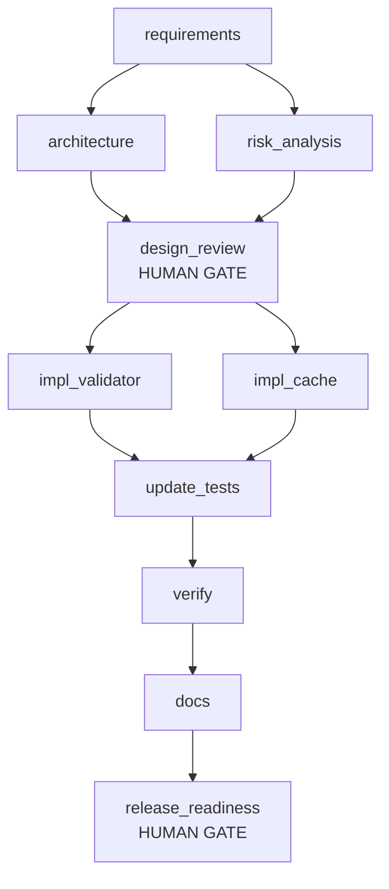

# Run report: ambiguous

**Status:** COMPLETED

> Make our short links safer and faster.

**Audit chain:** VALID - 114 records, chain intact

## Workflow graph

Parallel layers: [[requirements], [architecture, risk_analysis], [design_review], [impl_validator, impl_cache], [update_tests], [verify], [docs], [release_readiness]]  
Join (sync) nodes: [design_review, update_tests]

## Nodes

| Node | Agent | Status | Attempts | Fallback | Rollbacks | Runs |
|---|---|---|---|---|---|---|
| requirements | requirements | DONE | 1 | false | 0 | 1 |
| architecture | architect | DONE | 1 | false | 0 | 2 |
| risk_analysis | risk | DONE | 1 | false | 0 | 2 |
| design_review (gate) | reviewer | DONE | 1 | false | 0 | 2 |
| impl_validator | implementer | DONE | 1 | false | 0 | 2 |
| impl_cache | implementer | DONE | 1 | false | 0 | 1 |
| update_tests | tester | DONE | 1 | false | 0 | 2 |
| verify | reviewer | DONE | 1 | false | 0 | 1 |
| docs | documenter | DONE | 1 | false | 0 | 1 |
| release_readiness (gate) | release-manager | DONE | 1 | false | 0 | 1 |

## Reliability metrics

| Metric | Value |
|---|---|
| nodes_total | 10 |
| nodes_done | 10 |
| node_executions_completed | 15 |
| node_success_rate | 1.0 |
| first_attempt_success_rate | 1.0 |
| attempts | 15 |
| failed_attempts | 0 |
| retries | 0 |
| fallbacks | 0 |
| rollbacks | 5 |
| policy_blocks | 0 |
| approvals_requested | 3 |
| approvals_denied | 0 |
| approval_wait_ms | 0 |
| replans | 1 |
| mttr_ms | null |
| recovered_incidents | 0 |
| unrecovered_incidents | 0 |
| e2e_latency_ms | 17296 |

## Decisions

- **approval-granted** [design_review] by auto-approver: Approve the assumptions made for the ambiguous terms 'safer' and 'faster'
- **clarification** [update_tests] by stakeholder: {AMB-1=Safer means HTTPS only for new links, and keep the host denylist.}
- **replan** by orchestrator: invalidated [architecture, risk_analysis, design_review, impl_validator, update_tests], retained [requirements, impl_cache]
- **approval-granted** [design_review] by auto-approver: Approve the assumptions made for the ambiguous terms 'safer' and 'faster'
- **approval-granted** [release_readiness] by auto-approver: Release approval - human owns the go/no-go decision

## Decision lineage (inputs to outputs)

| Node | Run | Agent | Consumed | Produced |
|---|---|---|---|---|
| requirements | 1 | requirements | {} | {req.functional=v1, req.security=v1, req.performance=v1, req.ambiguities=v1} |
| risk_analysis | 1 | risk | {req.functional=1, req.ambiguities=1} | {design.risks=v1} |
| architecture | 1 | architect | {req.functional=1, req.security=1, req.performance=1} | {design.architecture=v1, design.openapi=v1} |
| design_review | 1 | reviewer | {design.architecture=1, design.risks=1, req.ambiguities=1, req.security=1, req.performance=1} | {review.design=v1} |
| impl_validator | 1 | implementer | {req.security=1} | {code.validator=v1} |
| impl_cache | 1 | implementer | {req.performance=1} | {code.cache=v1} |
| update_tests | 1 | tester | {req.security=1, code.validator=1, code.cache=1} | {tests.updated=v1} |
| risk_analysis | 2 | risk | {req.functional=1, req.ambiguities=2} | {design.risks=v2} |
| architecture | 2 | architect | {req.functional=1, req.security=2, req.performance=1} | {design.architecture=v2, design.openapi=v1} |
| design_review | 2 | reviewer | {design.architecture=2, design.risks=2, req.ambiguities=2, req.security=2, req.performance=1} | {review.design=v2} |
| impl_validator | 2 | implementer | {req.security=2} | {code.validator=v2} |
| update_tests | 2 | tester | {req.security=2, code.validator=2, code.cache=1} | {tests.updated=v2} |
| verify | 1 | reviewer | {tests.updated=2} | {verify.report=v1} |
| docs | 1 | documenter | {design.openapi=1, req.functional=1, verify.report=1} | {docs.readme=v1} |
| release_readiness | 1 | release-manager | {verify.report=1, docs.readme=1, req.ambiguities=2} | {release.readiness=v1, release.report=v1} |

## Artifact versions

| Artifact | Version | Produced by | SHA-256 |
|---|---|---|---|
| req.functional | v1 | requirements | 91e777aa774b |
| req.security | v1 | requirements | 0e73c69a85bf |
| req.security | v2 | human:stakeholder | a3f82f442063 |
| req.performance | v1 | requirements | 7acf68d76faa |
| req.ambiguities | v1 | requirements | d38bc8dc41dd |
| req.ambiguities | v2 | human:stakeholder | 229409773b78 |
| design.risks | v1 | risk_analysis | 8e766d804405 |
| design.risks | v2 | risk_analysis | 207e3b001954 |
| design.architecture | v1 | architecture | 0cfabccc954e |
| design.architecture | v2 | architecture | 1f2f90444603 |
| design.openapi | v1 | architecture | 089213298a7b |
| review.design | v1 | design_review | 2affa26b9ca9 |
| review.design | v2 | design_review | 8a1dc9763c8e |
| code.validator | v1 | impl_validator | fc03a0a5a8d5 |
| code.validator | v2 | impl_validator | 9fb950c87a8b |
| code.cache | v1 | impl_cache | 7acd9e82b9c6 |
| tests.updated | v1 | update_tests | d56898579d60 |
| tests.updated | v2 | update_tests | 5f2c61359ef9 |
| verify.report | v1 | verify | 0317dcbecd5b |
| docs.readme | v1 | docs | 6775618d5c84 |
| release.readiness | v1 | release_readiness | cd02d56c329c |
| release.report | v1 | release_readiness | 0cd362f21593 |
