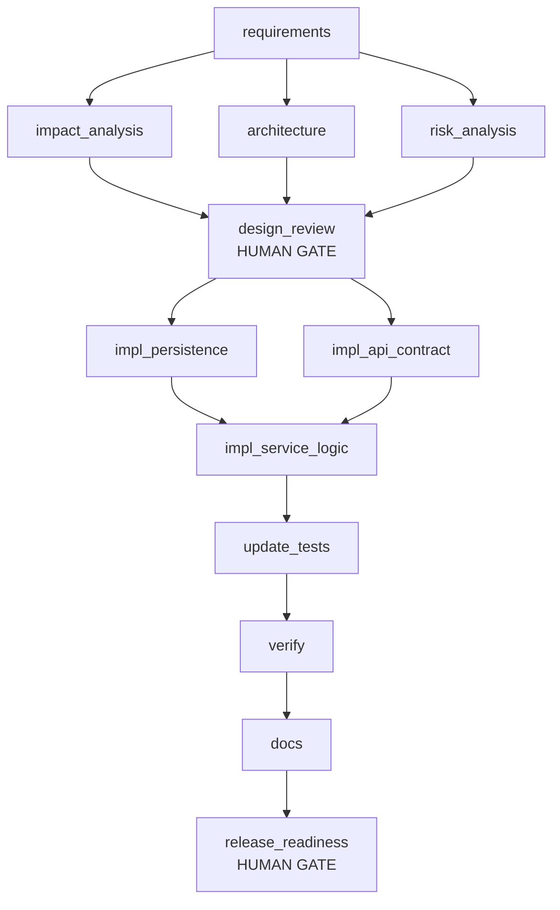

# Run report: brownfield

**Status:** HALTED (node impl_persistence failed: InjectedFault: injected exception in impl_persistence)

> Add link expiry (optional expiresAt on create, redirect returns 410 after expiry) and per-day click analytics on the stats endpoint. Fix bug: the reserved-word check for custom aliases can be bypassed by changing the case, and aliases that differ only by case are accepted.

**Audit chain:** VALID - 66 records, chain intact

## Workflow graph

Parallel layers: [[requirements], [impact_analysis, architecture, risk_analysis], [design_review], [impl_persistence, impl_api_contract], [impl_service_logic], [update_tests], [verify], [docs], [release_readiness]]  
Join (sync) nodes: [design_review, impl_service_logic]

## Nodes

| Node | Agent | Status | Attempts | Fallback | Rollbacks | Runs |
|---|---|---|---|---|---|---|
| requirements | requirements | DONE | 1 | false | 0 | 1 |
| impact_analysis | impact-analyst | DONE | 1 | false | 0 | 1 |
| architecture | architect | DONE | 1 | false | 0 | 1 |
| risk_analysis | risk | DONE | 1 | false | 0 | 1 |
| design_review (gate) | reviewer | DONE | 1 | false | 0 | 1 |
| impl_persistence | implementer | FAILED | 4 | true | 0 | 0 |
| impl_api_contract | implementer | DONE | 1 | false | 0 | 1 |
| impl_service_logic | implementer | SKIPPED | 0 | false | 0 | 0 |
| update_tests | tester | SKIPPED | 0 | false | 0 | 0 |
| verify | reviewer | SKIPPED | 0 | false | 0 | 0 |
| docs | documenter | SKIPPED | 0 | false | 0 | 0 |
| release_readiness (gate) | release-manager | SKIPPED | 0 | false | 0 | 0 |

## Reliability metrics

| Metric | Value |
|---|---|
| nodes_total | 12 |
| nodes_done | 6 |
| node_executions_completed | 6 |
| node_success_rate | 0.5 |
| first_attempt_success_rate | 1.0 |
| attempts | 10 |
| failed_attempts | 4 |
| retries | 2 |
| fallbacks | 1 |
| rollbacks | 0 |
| policy_blocks | 0 |
| approvals_requested | 2 |
| approvals_denied | 0 |
| approval_wait_ms | 0 |
| replans | 0 |
| mttr_ms | null |
| recovered_incidents | 0 |
| unrecovered_incidents | 1 |
| e2e_latency_ms | 525 |

## Decisions

- **approval-granted** [design_review] by auto-approver: Approve additive API contract change (expiresAt, clicksByDay) and schema migration
- **approval-granted** [impl_api_contract] by auto-approver: high-impact changes: [public API contract change]
- **safe-stop** by orchestrator: node impl_persistence failed: InjectedFault: injected exception in impl_persistence

## Decision lineage (inputs to outputs)

| Node | Run | Agent | Consumed | Produced |
|---|---|---|---|---|
| requirements | 1 | requirements | {} | {req.functional=v1, req.security=v1, req.performance=v1, req.ambiguities=v1} |
| risk_analysis | 1 | risk | {req.functional=1, req.ambiguities=1} | {design.risks=v1} |
| architecture | 1 | architect | {req.functional=1, req.security=1, req.performance=1} | {design.architecture=v1, design.openapi=v1} |
| impact_analysis | 1 | impact-analyst | {req.functional=1} | {impact.report=v1, impact.summary=v1} |
| design_review | 1 | reviewer | {impact.report=1, impact.summary=1, design.openapi=1, design.risks=1} | {review.design=v1} |
| impl_api_contract | 1 | implementer | {impact.summary=1} | {code.api_contract=v1} |

## Artifact versions

| Artifact | Version | Produced by | SHA-256 |
|---|---|---|---|
| req.functional | v1 | requirements | eca8f88ad98a |
| req.security | v1 | requirements | e6a2a98ba81f |
| req.performance | v1 | requirements | f461ced770e3 |
| req.ambiguities | v1 | requirements | 27f34907456f |
| design.risks | v1 | risk_analysis | 8b1acb740e24 |
| design.architecture | v1 | architecture | 30c33610d1d0 |
| design.openapi | v1 | architecture | 1a276f8dd676 |
| impact.report | v1 | impact_analysis | eeeb5812d0a5 |
| impact.summary | v1 | impact_analysis | eae16f291823 |
| review.design | v1 | design_review | 3a57a7d044f5 |
| code.api_contract | v1 | impl_api_contract | bb4549ddcf3b |
