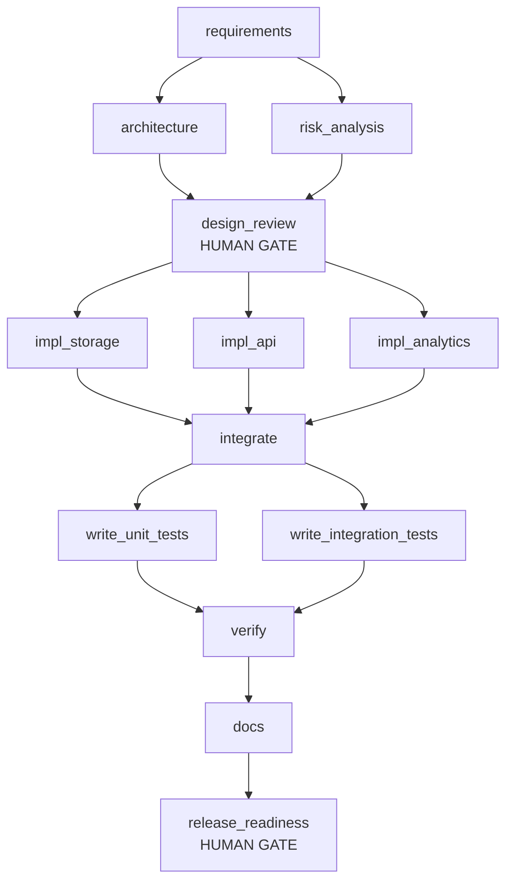

# Run report: greenfield

**Status:** COMPLETED

> Build a URL shortener service. Users create short URLs from long URLs (with optional custom aliases), anyone can redirect via the short code, links can be deleted by an administrator, and click analytics are available per link. The service must be reliable: apply rate limiting on write APIs and validate destination URLs for safety (SSRF).

**Audit chain:** VALID - 97 records, chain intact

## Workflow graph

Parallel layers: [[requirements], [architecture, risk_analysis], [design_review], [impl_storage, impl_api, impl_analytics], [integrate], [write_unit_tests, write_integration_tests], [verify], [docs], [release_readiness]]  
Join (sync) nodes: [design_review, integrate, verify]

## Nodes

| Node | Agent | Status | Attempts | Fallback | Rollbacks | Runs |
|---|---|---|---|---|---|---|
| requirements | requirements | DONE | 1 | false | 0 | 1 |
| architecture | architect | DONE | 1 | false | 0 | 1 |
| risk_analysis | risk | DONE | 1 | false | 0 | 1 |
| design_review (gate) | reviewer | DONE | 1 | false | 0 | 1 |
| impl_storage | implementer | DONE | 1 | false | 0 | 1 |
| impl_api | implementer | DONE | 1 | false | 0 | 1 |
| impl_analytics | implementer | DONE | 1 | false | 0 | 1 |
| integrate | implementer | DONE | 1 | false | 0 | 1 |
| write_unit_tests | tester | DONE | 1 | false | 0 | 1 |
| write_integration_tests | tester | DONE | 1 | false | 0 | 1 |
| verify | reviewer | DONE | 1 | false | 0 | 1 |
| docs | documenter | DONE | 1 | false | 0 | 1 |
| release_readiness (gate) | release-manager | DONE | 1 | false | 0 | 1 |

## Reliability metrics

| Metric | Value |
|---|---|
| nodes_total | 13 |
| nodes_done | 13 |
| node_executions_completed | 13 |
| node_success_rate | 1.0 |
| first_attempt_success_rate | 1.0 |
| attempts | 13 |
| failed_attempts | 0 |
| retries | 0 |
| fallbacks | 0 |
| rollbacks | 0 |
| policy_blocks | 0 |
| approvals_requested | 2 |
| approvals_denied | 0 |
| approval_wait_ms | 0 |
| replans | 0 |
| mttr_ms | null |
| recovered_incidents | 0 |
| unrecovered_incidents | 0 |
| e2e_latency_ms | 22746 |

## Decisions

- **approval-granted** [design_review] by auto-approver: Approve architecture, API contract and risk register before implementation starts
- **approval-granted** [release_readiness] by auto-approver: Release approval - human owns the go/no-go decision

## Decision lineage (inputs to outputs)

| Node | Run | Agent | Consumed | Produced |
|---|---|---|---|---|
| requirements | 1 | requirements | {} | {req.functional=v1, req.security=v1, req.performance=v1, req.ambiguities=v1} |
| risk_analysis | 1 | risk | {req.functional=1, req.ambiguities=1} | {design.risks=v1} |
| architecture | 1 | architect | {req.functional=1, req.security=1, req.performance=1} | {design.architecture=v1, design.openapi=v1} |
| design_review | 1 | reviewer | {design.architecture=1, design.openapi=1, design.risks=1, req.ambiguities=1} | {review.design=v1} |
| impl_analytics | 1 | implementer | {design.openapi=1} | {code.analytics=v1} |
| impl_storage | 1 | implementer | {design.openapi=1} | {code.storage=v1} |
| impl_api | 1 | implementer | {design.openapi=1} | {code.api=v1} |
| integrate | 1 | implementer | {code.storage=1, code.api=1, code.analytics=1} | {code.integrate=v1} |
| write_integration_tests | 1 | tester | {code.integrate=1} | {tests.integration=v1} |
| write_unit_tests | 1 | tester | {code.integrate=1} | {tests.unit=v1} |
| verify | 1 | reviewer | {tests.unit=1, tests.integration=1} | {verify.report=v1} |
| docs | 1 | documenter | {design.openapi=1, req.functional=1, verify.report=1} | {docs.readme=v1} |
| release_readiness | 1 | release-manager | {verify.report=1, docs.readme=1} | {release.readiness=v1, release.report=v1} |

## Artifact versions

| Artifact | Version | Produced by | SHA-256 |
|---|---|---|---|
| req.functional | v1 | requirements | b2a541b87121 |
| req.security | v1 | requirements | e6a2a98ba81f |
| req.performance | v1 | requirements | f461ced770e3 |
| req.ambiguities | v1 | requirements | 27f34907456f |
| design.risks | v1 | risk_analysis | 5101858aaa66 |
| design.architecture | v1 | architecture | 58ddc50e0b19 |
| design.openapi | v1 | architecture | 2c604e8b42b3 |
| review.design | v1 | design_review | 76db035a2f29 |
| code.analytics | v1 | impl_analytics | fa28439903e7 |
| code.storage | v1 | impl_storage | 208c16cdac94 |
| code.api | v1 | impl_api | 5bfa52e8c46c |
| code.integrate | v1 | integrate | 25260decce18 |
| tests.integration | v1 | write_integration_tests | 75dcb5cf65e6 |
| tests.unit | v1 | write_unit_tests | e4f1d35b60d7 |
| verify.report | v1 | verify | dd37f61425ca |
| docs.readme | v1 | docs | 5de6f513856d |
| release.readiness | v1 | release_readiness | afc0078d01bc |
| release.report | v1 | release_readiness | 8fb66cf7bb4f |
