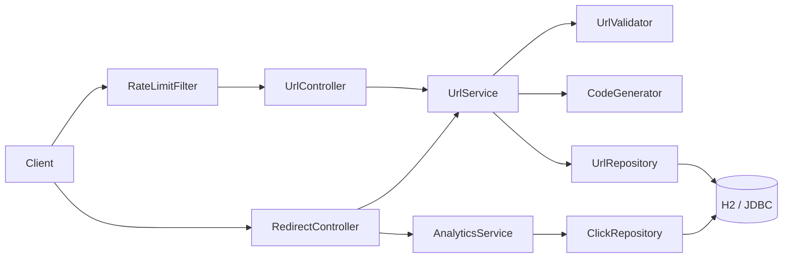

# Architecture

## Components

Layering: api -> service -> repository interface -> JDBC. Storage is replaceable behind `UrlRepository`.

## Key decisions (ADRs)

1. **302 not 301** - permanent redirects are cached by browsers, which would hide clicks and make delete/expiry ineffective.
2. **Soft delete** - preserves analytics history and gives a deterministic 410 for removed links.
3. **Random base62 codes with bounded collision retry** - unguessable, no coordination needed; allocation fails closed (503) after 5 attempts.
4. **In-memory token bucket per client address** - simple and fast; not shared across instances (see risks).
5. **SSRF guard at URL level** - scheme allow-list, credentials rejected, private/loopback/link-local/numeric hosts rejected; no DNS resolution at creation time.
7. **Host denylist** - configurable via `shortener.blocked-domains`; complements, not replaces, SSRF checks.

## Allowed schemes

[http, https]
